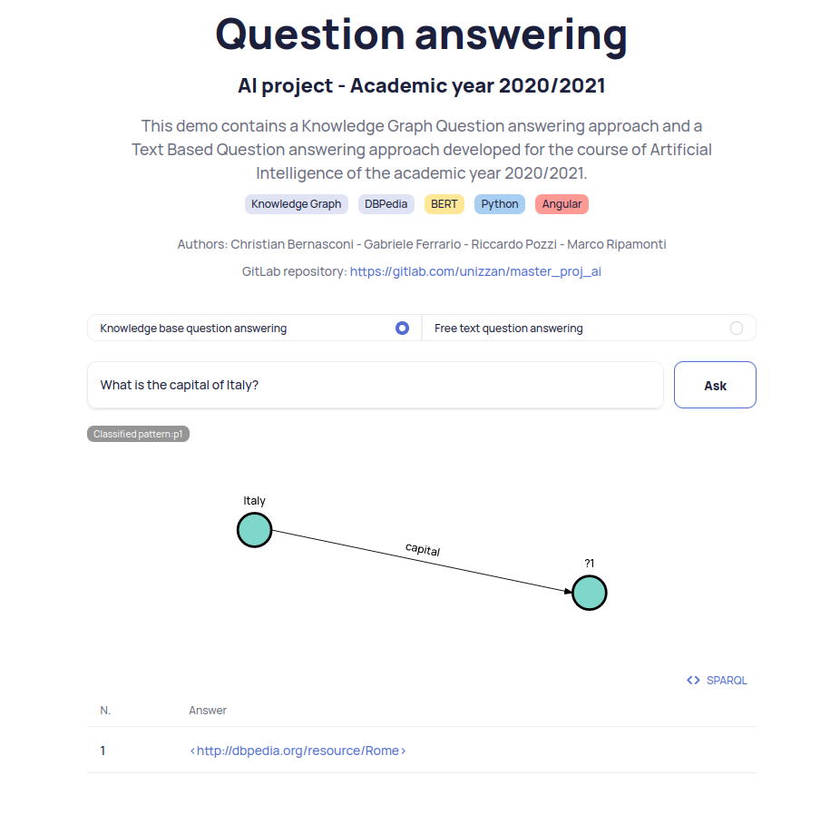

# Question Answering: Structured vs Unstructured

This project is for the master course of Artificial Intelligence from Università Milano Bicocca.

The project aims to explore and compare open domain question answering approaches over both structured (Knowledge Graph) and unstructured data (Free-text), using respectively DBPedia and Wikipedia as information sources. A prototype of both types of approaches has been implemented. This has highlighted the issues and complexities behind the implementation of a QA system in a real-world scenario. To understand the pros and cons of the implemented approaches different kinds of evaluation have been performed.

To know more about the project look at the [Presentation](Presentation.pdf)



# Group

- Christian Bernasconi 816423
- Gabriele Ferrario 817518
- Riccardo Pozzi 807857
- Marco Ripamonti 806785

# Directory structure
```
demo # demo interface
knowledgeGraph # knowledge graph QA
text # free text QA
evaluation # evaluation script to compare the two approaches
data # create this folder and put models there
```

# Run the demo
The demo loads both the Graph based and the Free text QA therefore requires much memory.

## With docker (suggested)
Install docker and docker-compose (https://docs.docker.com/get-docker/ https://docs.docker.com/compose/install/), then:
```
cd docker
docker-compose up -d
# some time is required at first start to download models
```
Now open [http://localhost](http://localhost) and you should access QA demo.

## Install python requirements
The project has been developed on python3.8

- Create a virtualenv (suggested)
    ```
    python -m venv venv
    ```
    and activate it
    ```
    source venv/bin/activate # linux
    # or for windows
    .\venv\Scripts\activate.bat
    ```
- Install requirements
    ```
    pip install -r demo/backend/requirements.txt
    pip install -r knowledgeGraph/kgqalib/requirements.txt
    pip install -r text/ftqalib/requirements.txt
    ```
- Download required models/data
    - spacy:
        ```
        python -m spacy download en_core_web_lg
        ```
    - nltk stopwords
        ```
        python -c 'import nltk;nltk.download("stopwords")'
        ```
    - Glove embeddings in gensim format; download from [https://drive.google.com/file/d/1wHP5tHvBiG5aHuCHxotYQYLeQxRKI-gm/view?usp=sharing](https://drive.google.com/file/d/1wHP5tHvBiG5aHuCHxotYQYLeQxRKI-gm/view?usp=sharing) and save in `data/glove.840B.300d.gensim`
    - Pretrained pattern classifier; download from [https://drive.google.com/file/d/14OtRDFrT-mAEDSqBX7dQKJGAG39xPd7c/view?usp=sharing](https://drive.google.com/file/d/14OtRDFrT-mAEDSqBX7dQKJGAG39xPd7c/view?usp=sharing) and save in `data/models/pattern_classifier.h5`

- Run the backend with
    ```
    python demo/backend/server.py
    ```
    The first run will download some required models.
    Then backend will be available at [http://localhost:5000](http://localhost:5000).

- Download pre-built frontend from [https://drive.google.com/file/d/1UwBqODTaZyRMZW2HrPVRQBqHe-KU1ssL/view?usp=sharing](https://drive.google.com/file/d/1UwBqODTaZyRMZW2HrPVRQBqHe-KU1ssL/view?usp=sharing), unzip it and then serve it for instance with
    ```
    cd frontend
    python -m http.server 4200
    ```
    (port 4200 should be already in backend CORS origin as it is the default angularJS development server port)
